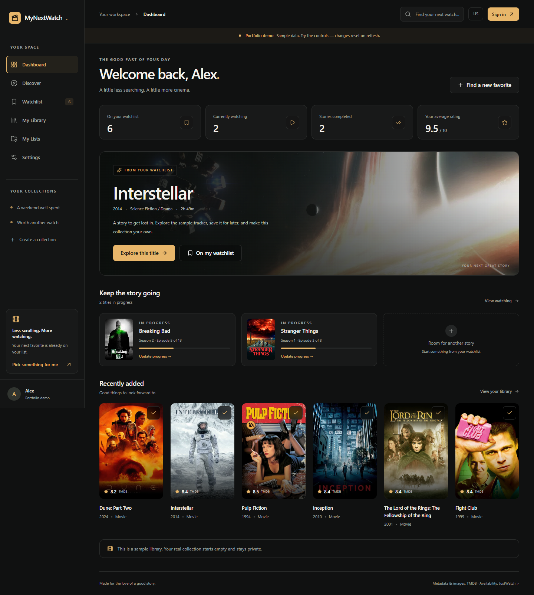

# MyNextWatch

A personal home for the movies and shows you love. Keep a private watchlist, track your progress, rate your favorites, and make collections worth sharing.

**Suggested repository name:** `mynextwatch`

**Source repository:** [samirhaz/MyNextWatch](https://github.com/samirhaz/MyNextWatch)

## Try it locally

Use Node.js **24 LTS** (or Node.js 22.13+ in the 22.x series).

```powershell
npm ci
if (-not (Test-Path .env)) { Copy-Item .env.example .env }
npm run dev
```

Open **http://localhost:3000/demo/dashboard**. The demo works without credentials. It is explicitly labeled, uses sample data, resets changes on refresh, and never writes to real accounts. Your real account starts with an empty library.

On Windows, after installing dependencies, you can double-click **Start-MyNextWatch.cmd**. It opens the sign-in page in Chrome and starts the website if it is not already running. Keep its terminal window open while using the development server; press **Ctrl+C** to stop it. The launcher also starts the workspace's portable local MySQL instance if that optional setup is present. Fresh checkouts should use the MySQL setup below.

For real persistence, start MySQL, fill in `.env`, and apply migrations:

```powershell
docker compose up -d --wait mysql
npm run db:migrate
npm run dev
```

Sign in at **http://localhost:3000/signin** once GitHub OAuth is configured. **Do not commit `.env` or share its secrets.**

The [Windows and VS Code guide](docs/SETUP-WINDOWS.md) covers Docker, an existing MySQL installation, every environment variable, GitHub OAuth, TMDB, and connecting your repository. The [deployment guide](docs/DEPLOYMENT.md) covers Vercel and separately hosted MySQL.

## What you can do

- Track movies and TV shows as Plan to Watch, Watching, Completed, On Hold, or Dropped. The default watchlist is the Plan to Watch view of the library.
- Add/remove titles, see dates added, and edit or remove whole-number personal ratings from 1 to 10. TMDB ratings are labeled separately.
- Create, rename, describe, and delete custom lists. A title can appear in multiple lists without duplicate membership. Removing a list does not remove library entries or ratings.
- Search movies or TV shows with debounced input, stale-request cancellation, and pagination. Browse trending titles or use TMDB's discovery filters.
- Filter entire owned collections by type, genre, status, release year, personal rating, and regional platform; sort by title, date added, personal rating, or release date. Filter state stays in the URL.
- View title details, missing-image fallbacks, genres, runtime or seasons, and regional streaming offers separated into subscription, free, ads, rental, and purchase.
- Save your country, private notes, and season/episode progress in MySQL.
- Enable read-only sharing for your watchlist or a custom list. Regenerate or revoke links. Visitors can view without logging in; signed-in visitors can save titles into their own accounts.
- See your dashboard, continue watching, and randomly pick from your filtered watchlist.

Forms have labels and visible keyboard focus. Dialogs use Radix focus management through shadcn/ui components. The layout adapts to mobile, tablet, and desktop, respects reduced motion, and includes loading, empty, error, and save-feedback states.

## Stack

| Layer          | Choice                                                                             |
| -------------- | ---------------------------------------------------------------------------------- |
| Application    | Next.js 16 App Router, React 19, strict TypeScript                                 |
| Interface      | Tailwind CSS 4, customized shadcn/ui primitives, Radix dialogs, Lucide icons       |
| Authentication | Auth.js v5 with GitHub OAuth, Prisma adapter, database sessions                    |
| Database       | **MySQL 8.4**, Prisma 7 and the supported MySQL/MariaDB JavaScript driver adapter  |
| Metadata       | TMDB API; JustWatch provider information supplied through TMDB                     |
| Validation     | Zod on server inputs and upstream API responses                                    |
| Verification   | ESLint, TypeScript, Vitest, disposable MySQL integration tests, Playwright and axe |
| Deployment     | Vercel Node.js runtime plus separately hosted MySQL                                |

Auth.js still distributes the documented Next.js v5 integration under a beta tag. The exact version is pinned. Prisma is pinned to stable 7.10 rather than the registry's current 8.0 release candidate. The lockfile fixes the installed dependency graph.

The Prisma adapter uses a JavaScript package named `mariadb` to connect to **MySQL**. It does not substitute MariaDB, PostgreSQL, SQLite, or Supabase for the database.

## Architecture and security

Private route handlers resolve the authenticated user on the server. Services include that user ID in private reads and writes, reject ID-based access to another user's data, and validate ownership again inside transactions when related writes depend on a list.

Database uniqueness constraints enforce user/title membership, list/title membership, and the movie-or-TV/TMDB ID pair. MySQL CHECK constraints back up 1–10 rating limits. Foreign keys and cascades preserve the distinction between library data and custom lists.

Sharing uses cryptographically random bearer tokens; only hashes are stored. New lists are private. Public responses select only intended list information and title metadata, never the owner's notes, ratings, progress, email, or unrelated lists. Shared pages are `noindex` and use uncached responses. Anyone holding an enabled link can view or copy its contents; revocation blocks future access but cannot recall copies.

Mutations reject cross-origin requests and oversized JSON. MySQL-backed rate-limit buckets are shared across application instances. TMDB access is server-side with timeouts and honest error states. A small Prisma connection pool limits connections per instance; see deployment guidance for the total concurrency budget.

Read the [architecture and interview guide](docs/ARCHITECTURE.md) for a request walkthrough, file map, tradeoffs, and database diagram.

## Verify the project

```powershell
npm run lint
npm run typecheck
npm test
npm run build
```

For tests against actual MySQL, use the **separate disposable** database in `.env.example`:

```powershell
docker compose --profile test up -d --wait mysql-test
npm run test:db
npx playwright install chromium
npm run test:e2e:db
```

`npm run test:e2e` runs the demo and unauthenticated browser checks. The database browser scenario is explicitly skipped unless you use `test:e2e:db` with a valid test database. The database runner refuses a database name that does not end in `_test`, never resets a database, applies committed migrations, and removes only generated test records.

Browser tests use real Auth.js database sessions created only in the disposable database; there is no test-login backdoor in the application. Metadata fixtures are synthetic and clearly identified. Real GitHub OAuth and live TMDB integration require your own credentials and an additional manual check.

GitHub Actions runs lint, type checking, unit tests, MySQL tests, a production build, and browser tests against a temporary MySQL service. Its public fixture passwords do not grant access to anything outside the job. No account secrets are committed.

See [the verification record](docs/VERIFICATION.md) for checks actually run and any remaining limitations. Use `npm run format` for consistent source formatting.

## Screenshots and portfolio



[View the mobile screenshot](docs/screenshots/dashboard-mobile.png).

Real browser captures of the running sample demo are stored in `docs/screenshots` when screenshot capture is enabled. They are not fabricated images. To refresh them during browser tests:

```powershell
$env:CAPTURE_SCREENSHOTS="1"
npm run test:e2e
```

The [portfolio guide](docs/PORTFOLIO.md) contains a factual CV description and LinkedIn project description. Replace placeholder repository/deployment URLs only with URLs you own.

## Caching and attribution

MyNextWatch uses only the supplied regional watch links. It does not invent playback URLs or treat rental offers as subscriptions. Platform filtering includes all supplied offer categories; title details explain which apply. Collection filters use saved availability snapshots and offer a complete-collection refresh action.

TMDB fetch responses are not persisted in Next.js's HTTP cache. Database metadata is refreshed after seven days on access, and providers after one day. A daily maintenance job purges cached metadata older than 90 days, while retaining user-owned tracking information and external identifiers. Configure `CRON_SECRET` and monitor the job in production. Private collection reads also purge expired metadata. The current API terms prohibit caching TMDB information for more than six months; the shorter retention is intentional.

**This product uses TMDB and the TMDB APIs but is not endorsed, certified, or otherwise approved by TMDB.** Movie and television images belong to their respective rights holders. Streaming availability comes from **JustWatch** through TMDB. An approved, unmodified TMDB logo and attribution appear in the app's About & Credits page.

Review the current terms before publishing or changing the business model. Noncommercial API access and commercial licensing have different requirements. This project does not add monetization or AI recommendations.

## Official references checked during implementation

- [Next.js installation and supported runtimes](https://nextjs.org/docs/app/getting-started/installation)
- [Auth.js installation](https://authjs.dev/getting-started/installation), [Prisma adapter](https://authjs.dev/getting-started/adapters/prisma), [GitHub provider](https://authjs.dev/getting-started/providers/github)
- [Prisma MySQL connector and adapter](https://www.prisma.io/docs/orm/overview/databases/mysql)
- [shadcn/ui Next.js setup](https://ui.shadcn.com/docs/installation/next)
- [TMDB API terms](https://www.themoviedb.org/api-terms-of-use), [attribution](https://www.themoviedb.org/about/logos-attribution), [watch-provider requirements](https://developer.themoviedb.org/reference/movie-watch-providers), [rate limiting](https://developer.themoviedb.org/docs/rate-limiting)
- [Vercel cron authentication and maintenance](https://vercel.com/docs/cron-jobs/manage-cron-jobs)

Dependency overrides pin patched `mariadb`, `mysql2`, and `deepmerge-ts` versions because Prisma's dependency ranges included versions with published advisories. ESLint uses the official Next.js plugin, TypeScript rules, and React Hooks rules directly, avoiding the aggregate configuration's plugins that only declare ESLint 9 support. Revisit overrides when upgrading Prisma, and rerun the complete verification suite.
