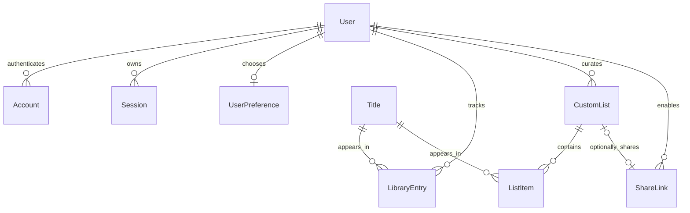

# How MyNextWatch works

MyNextWatch is a single Next.js application. React renders the tracker, Next.js handles requests, MySQL stores account data, and TMDB supplies metadata. There is no separate API service, recommendation engine, or social network.

## Follow one save

1. The user clicks **Add to watchlist** on a title card.
2. `AppProvider` sends only the media type and TMDB ID to `POST /api/library`.
3. `privateRequest` checks the request origin, resolves the Auth.js session, and applies a database-backed request limit. A user ID from the browser is never accepted.
4. Zod validates the input. The TMDB module fetches or refreshes trusted metadata; the browser cannot submit invented titles or provider records to the real database.
5. The library service inserts the user's membership. The unique `(userId, titleId)` index prevents duplicate saves, including concurrent clicks.
6. After MySQL confirms success, the UI reloads the owned snapshot and announces success. A failed write produces an error and keeps the previous UI state.

## Code map

| Location                            | Responsibility                                                   |
| ----------------------------------- | ---------------------------------------------------------------- |
| `src/app`                           | Routes, protected server layout, errors and loading states       |
| `src/app/api`                       | Thin HTTP boundary; authentication, validation and service calls |
| `src/auth.ts`                       | GitHub OAuth and Auth.js database sessions                       |
| `src/lib/server/library-service.ts` | Owned library/list operations and sharing                        |
| `src/lib/server/tmdb.ts`            | Third-party requests, response validation, metadata cache        |
| `src/lib/server/database-client.ts` | MySQL adapter and connection-pool settings                       |
| `src/lib/server/request-input.ts`   | Same-origin checking and bounded JSON parsing                    |
| `src/lib/validation.ts`             | Shared Zod input contracts; always enforced on server            |
| `src/lib/filters.ts`                | Pure collection filtering and sorting                            |
| `src/components`                    | Feature components and accessible UI primitives                  |
| `src/lib/demo.ts`                   | Clearly labeled, isolated sample data                            |
| `prisma`                            | Relational schema and committed SQL migration                    |
| `tests`                             | Validation/filter tests, MySQL integration tests, browser flows  |

## Database relationships

`Title` is shared metadata, identified by the unique pair `(mediaType, tmdbId)`. Personal data lives on `LibraryEntry`, uniquely identified by `(userId, titleId)`. The default watchlist is a query for `PLAN_TO_WATCH`, so a title cannot drift between conflicting watchlist/library records.

Custom lists have their own memberships. Deleting a list cascades into its items and share link, but not into library entries. Deleting a library entry removes that user's rating, notes, and progress while retaining custom-list membership.

JSON is used for nested external metadata: genres, season summaries, and regional providers. Account data and relationships use normal relational tables. Check constraints back up rating and progress validation in MySQL.

## Privacy and sharing

All private service operations require the authenticated actor and include ownership in the query. A random-looking database ID is not authorization. The public sharing reader selects only list information, title metadata, and dates added; it never selects notes, personal ratings, emails, or progress.

Sharing uses 32 cryptographically random bytes, encoded as 43 URL-safe characters. Only a SHA-256 hash is stored. The raw URL is returned once to its owner. Regeneration replaces the hash; disabling deletes the row. Old links fail on subsequent requests. Already downloaded information cannot be recalled. Shared pages request fresh data and periodically recheck the link; `noindex` is indexing guidance only.

GitHub login uses profile/email permissions and database sessions. It grants no repository access. GitHub repository publishing is a separate, owner-controlled setup step.

## Search, filtering, and scale

Discovery requests are debounced by 350 ms. AbortController cancels obsolete requests, and result state is keyed to the current query and page. Loading older pages cannot overwrite newer searches. TMDB's movie and TV searches are separate, and discovery filters are sent upstream before pagination. Unsupported search/filter combinations are rejected by the server.

Owned collections are loaded in full and filtered before the UI shows its first 24 cards. The interface explicitly shows matching and total counts. This is a deliberate, understandable design for a personal tracker. For very large libraries, move filters and pagination into indexed database queries and normalize provider memberships; do not silently cap the existing snapshot.

Provider filters match any supplied offer category, including rental/purchase, for the saved country. The details page separates offer categories. Saved provider snapshots may be out of date; users can refresh a complete collection in batches of four. Per-user request limits can interrupt a very large refresh, in which case the UI reports it and keeps successful updates.

## Deployment decisions

Database code runs in Node.js. A lazy, process-global Prisma client avoids repeatedly constructing pools during hot reload. The MariaDB JavaScript driver is the Prisma-supported driver for **MySQL**; it does not change the database to MariaDB. The default pool is two connections per application instance, with explicit timeouts. A pool limit is per instance, not global; deployment concurrency must fit the database's total connection budget.

External requests use timeouts and Zod response validation. TMDB tokens stay on the server. HTTP responses containing user or sharing data are never cached. Metadata refreshes after seven days on access and provider data after one day. A daily maintenance task purges cached TMDB metadata older than 90 days, keeping user-owned data and external identifiers. The TMDB terms currently set a six-month cache maximum; 90 days gives operating margin.

## Interview talking points

- Explain why a unique database constraint is stronger than disabling an Add button.
- Show the ownership predicate on a mutation, and the corresponding cross-user test.
- Explain the difference between identity, authentication, and record authorization.
- Explain why share tokens are hashed, what revocation can guarantee, and why `noindex` is not security.
- Explain the choice of one watchlist/library source of truth.
- Walk through success and failure paths in a save, including a write that succeeds but a refresh that fails.
- Discuss the tradeoff of loading a complete personal collection versus server-side pagination at larger scale.
- Be clear that OAuth provider login and live TMDB calls require real credentials; test sessions and synthetic metadata exercise the application's own boundaries without pretending to verify those providers.
